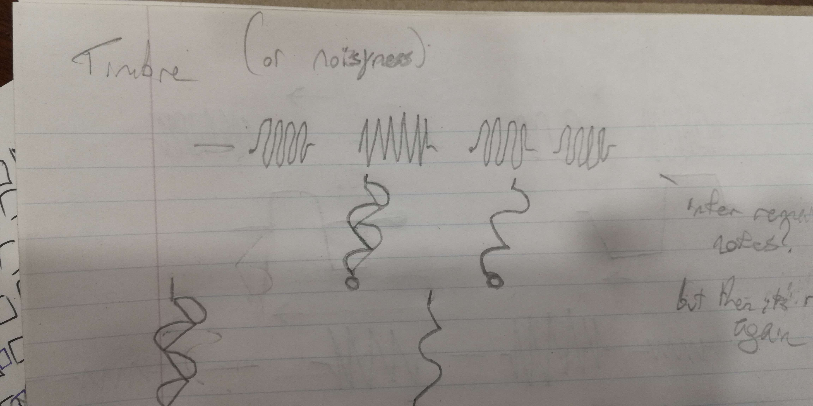
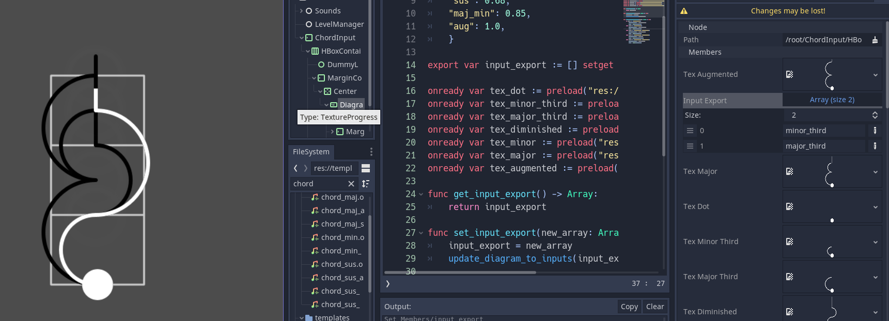

# What is Soundsolve?

Soundsolve is a prototype I'm working on for a music-based puzzle game. Inspired by the ephiphany-based progression of The Witness, and the adventurous spatial exploration of games like Myst and Antichamber.

## What are these devlogs going to look like?

To be honest, these early posts will be extrapolations from my notes. They may not make sense, and that's partially intentional. I'm still working it out for myself, and at every stage someone asks me a new question that makes me rework how I think about this game.

The final product will definitely look very different.

## What's stopping you from just making the game? Why make a prototype?

Games are expensive to make. Even on a budget of $0, they take time away from my life. I could be spending that time doing commission work, or doing other freelance activities. So for the sake of this game, time is money.

But, little bursts of time spent don't feel like much. What I'm hoping to accomplish is to really plan out this game so there's a conceivable "end" to the tunnel of development really early on. Something to shoot for, and something that seems entirely achievable on my own.

I cannot make an open-world MMORPG music puzzle game on my own with $0. There's not much I can actually make on my own with $0. So I'm trying to keep my expectations in check and keep the project as small as possible.

So just when it seems like I'm about to go off on how I want to make the next Antichamber, but for music puzzles, keep in mind I'm specifically trying to avoid that path as much as possible, until I can find the smallest possible version of that game to the point where I can reasonably make it happen.

# Let's Talk About the Game

So, Soundsolve!

Why did I start this project? To be honest, I was always disappointed by where The Witness' audio puzzles stopped short of achieving something more complex, and frustrated that the bar to entry was still too high for most players to properly appreciate.

Even going back to Myst, there was one music puzzle, made frustrating by reliance on pitch and having fickle sliders with 88 positions. I want to take that music puzzle and reduce it to simplicity, and make something more fun out of it from my own music theory background.

<iframe width="560" height="315" src="https://www.youtube.com/embed/13D_W8lZVzQ?start=1254" title="YouTube video player" frameborder="0" allow="accelerometer; autoplay; clipboard-write; encrypted-media; gyroscope; picture-in-picture; web-share" allowfullscreen></iframe>

There's too many notes, the impotence isn't there to listen and expect to remember pitch, and there's multiple stages. But at least you can't brute force it. ;)

In spite of the Witness' poor accessibility, I wanted an audio puzzle game that would still be playable without the sound on. I still wanted this game to reward players for listening closely, to them gain an appreciation for sound and its many properties.

# My Notes

Here's where things get a bit chaotic. Just making sure you're ready. Here are my notes from the day deliniated by headers.

## 2023-04-04

"Pitch" is a concept most people understand by demonstration. Even someone who is not hearing can feel the difference between the low-frequency shockwave of an explosion, compared to the tiny vibration of their phone. But to have people convey what pitch means, in a more objective sense, is the hard part.

Anyway, if you're interested in hearing more rambling from me, here's a 5 minute video I recorded right when I was in the thick of it:

<iframe width="553" height="315" src="https://www.youtube.com/embed/wWKtKtn_mWU" title="my audio jungle puzzle prompt" frameborder="0" allow="accelerometer; autoplay; clipboard-write; encrypted-media; gyroscope; picture-in-picture; web-share" allowfullscreen></iframe>

So anyway, next day. I'm still interested in this idea, but I need to figure out which input method to use for my puzzles.

Most of this came out of iterating on "the line" from The Witness. A shape you draw on a grid, with intersections determining where the line can go next. You also can't loop over your own line.

But I wasn't happy with just stealing the line. I wasn't going to use all affordances of the line to my advantage. I couldn't see how covering intersections, defining regions, and navigating mazes would benefit the audio-focused gameplay. I'd just be making the sequel to a game that already did nearly everything it set out to do, with my own twist on it. Maybe that's what people want, but I feel like there's a simpler way to do it with fewer elements. (Plus, I don't want to be accused of being a blowhard.)

But while I’m in this derivative mindset, I spent some time drawing up how you could show the audio information visually as if it <em>were</em> The Witness. I thought about how you could make interesting Witness lines based on the main idea.

Original sketches I did in my “night of passion” are as follows:


This one shows changes in timbre, pitch, volume, and even rhythm. Each example shows the corresponding answer in a high-low distinction. Except for rhythm, which is traversed in a sequence of 3-way inputs to determine note length.



This one shows more in regards to timbre, and a graph to input them using a distinct visual indicator of timbre change over time. A bit complex, but it made me happy to assign unique line shapes to different audio properties like this.


This last one is a bit too complicated to explain in this one post, I'll come back to these ideas in a dedicated post since I'm really happy with the shapes I ended up drawing.

Anyways. Anothre day follows. I like the idea of the lines, but they're not unique enough to stand out. I swear there's a simpler way to do this. Especially on say, a smartphone.

So, if I’m not doing lines from The Witness...what am I doing for this puzzle game?

I’ve decided I’m gonna have multiple input methods, all revolving around the mouse or touchscreen.

My most common input is going to be a binary switch, kind of like Taiji. Only I want to emphase “on” vs “off” and have a stronger distinction to associate “up” with “on”.

More like inputting a code in an adventure game, the idea is to give the player a line of switches. The number of switches correspond to the unique elements in the sound clip. From left to right, the switches represent the time of different changes in the sound.

For each category of puzzle (say, pitch-based puzzles) player has to figure out which of the elements belongs “up” and which belongs “down”. Higher pitches go up, lower pitches go down.

Here's some sketches of what I was coming up with at the time for UI:


I am also considering adding an input method for 3-way distinction, which will be necessary for later pitch puzzles. I’m still trying to figure out what I want here.

I could change the on/off switches to vertical radio buttons to select high/med/low pitch. That’s probably the best answer even if I don’t like it. It feels less accessible to input a range in a slider than it does just pressing a button. I want to avoid the spaceship sliders in Myst where accuracy was really difficult to achieve. But hopefully, 3 inputs instead of like 40 will solve itself there.

It was at this point I started showing these drawings around a few puzzle game communities. Namely The Witness, Lingo, and Taiji. And I caught the attention of UX designer Juchu.

Now I’ve invited Juchu who is a UX designer onto the team. My hope is to slowly expand the team to take on the larger workload I’ve set out for myself.

Though I’m still considering pivoting the game away from pure puzzles and moving toward an adevnture game style. Something more art focused than raw rules. I think that would help broaden the appeal while playing to my own strengths of making story-based games.


## 2023-04-05

The 🚩 or ⏯️ button is meant to play the sound, though it's less convenient than autoplay, it's less distracting when you want to sit in silence and work through your audible memory.
I don't want people to idle and have these bird sounds playing for literal hours. I know how people just sit in front of panels in the witness. Nobody does it in the jungle, or they pause. Though maybe instead of "press to play" I'll just have a mute button?

Some discoveries:

- Chord tonality may be hard to interpret, I still want to do it as a bonus for the experts out there.
- Morse code doesnt only change the length of the note, the entire rhythm changes too. The classic SOS: `...---...` has less of a gap between short beeps than between long beeps.

Valerie sent me this quote:

"Niklas Luhmann (1992) considers salutary that the first words were actually noises, more clearly marked off from their surroundings than visible signs could be, given a world without voids but with pauses."
> In [The Niche Hypothesis], [Bernie Krause] argues that animal communication is not merely a sound, but also that these sounds are honed to a specific frequency and rhythm (a niche) within a habitat's soundscape (accounting for daytime, seasons, etc), such that niches do not overlap. In this manner, the consistency of a soundscape can be used to represent of the health of a habitat.

[https://www.xenopraxis.net/readings/krause_nichehypothesis.pdf](https://www.xenopraxis.net/readings/krause_nichehypothesis.pdf)

5 puzzles down, many more to go.

The hardest part is having to find new bird sounds for each puzzle, it's not easy to find the pattern that I want that will convey the right idea. Cuckoo is easy and cultural, even. Chickadee similarly. But more complex patterns become harder to translate. And I've noticed that it's not so easy to find birds that will chirp slowly at a pace that human language processing is good at anticipating. It's not like simon says, it's fast and kind of obfuscated by its complexity in timbres.

Considering how I want to implement rhythm or "counting". I think counting a fast rhythm is kind of lame and trivial? I can't find a way to encode "number of beeps" as player input without just having a boring spinbox: [https://xeno-canto.org/719869](https://xeno-canto.org/719869)

I definitely want to consider grasshoppers and fish in these puzzles, as their own sections when I feel like I've exercised what I can out of birds? But at that point I'm definitely busting out the spectrogram. 

Still have so many more ideas I wanna touch on but I'll need to add a shader parameter for sine shape and a noise toggle for animating the other mechanics I wanted to do.

## 2023-04-10

I got some really good feedback recently! My partner played 0.0 and they got through it okay, my friend unsus played 0.1 and they found some issues with later puzzles. My mom played 0.1 and she couldn't figure out the first puzzle's answer.

It's clear to me that, while generalizing for 2 inputs is helpful for simplicity, it limits the complexity of the puzzles, and introduces confusion when hearing people can denote multiple pitches but are asked to choose between two.

But in hindsight, I think pushing for simpler puzzles is a better answer for accessibility. I want to limit the number of 3-tone puzzles. 

Okay, I'm trying to improve the UI experience a bit here. I want the binary switches to look more like switches, not squares with no suggestion of detail. 


<iframe width="560" height="315" src="https://www.youtube.com/embed/-9eMrY6Rafk" title="YouTube video player" frameborder="0" allow="accelerometer; autoplay; clipboard-write; encrypted-media; gyroscope; picture-in-picture; web-share" allowfullscreen></iframe>

```gdscript
const OFFSETS = {
    "min": 0.375,
    "maj": 0.52,
    "sus": 0.68,
    "maj_min": 0.85,
    "aug": 1.0,
}
```


I just finished the input system for chords. I'm happy at how I kept it simple - just touching 2 buttons to make up to 4 different chord types. Each button press moves the TextureProgress to a different value - minor third, major third, sus, major/minor, and augmented.

Although the major/minor offset is the same height vertically, I'm hoping I can switch out the texture to show just the correct combination of circles to make the inputted chord. I'm probably going to rely on multiple overlapping TextureProgress to keep it quick and dirty. 🍝

Although Abi suggested doing intervals first to make sure people see the difference between m3 and M3. This way I could introduce the mechanic of using buttons for interval distance rather than as a toggle for pitch/volume like before. 
On top of this, she suggested arpeggiating the chord. Maybe this can be the 2nd sound cue in the hint since chords are just one-shots right now. 🎹 
What I still need to do is find a way to get just the line I want to appear on input. I may need to send some time sketching out how I want the screen to look for the chord puzzles:

- waveform
- chord diagram
- input buttons (m3, M3)
- submit
- replay hint

After sketching I might look at using multiple TextureProgress nodes for each of the 4 possible inputs, so their image can be revealed gradually.

When I'm tired of the pixellation I will definitely upgrade to drawing lines directly on screen. I'm avoiding the vector drawing route because I want to make sure both input methods are playable on mobile and desktop. 🖥️ 
I started to write a system for changing levels too. I was tired of manually linking filenames inside of each scene, when I'd rather edit a single resource that tracks progression of the levels. So I have a new LevelManager singleton which should help me group the levels together, and let me change the level order much faster. 
It's only holding the data right now, I still need to get the "next level" buttons in each scene to call that manager instead of calling the SceneTree itself.

I could've done this a while ago but I really did not want to add systemic complexity and shoot my momentum in the foot. I needed to bare some copy/pasting tedium for once in my life to see the parameters and needs of my own system.
I have a bad habit of overscoping my features and future-proofing for stuff that sounds nice but is totally unnecessary. A full options menu right now is unnecessary, getting more of the game in a playable state is what matters.
This has been a really nice project because the concept programmatically is simple: enter a keycode and hit submit. But it's the hints surrounding that keycode - the conceptual ideas - that are taking time to implement practically in a way that feels fair and nuanced.
This project is making me love gamedev again 😊
Oh! I killed 2 levels today 💀 I felt they were just not good hints and caused confusion in my playtests. I moved one level from Pitch to the new Volume category to narrow its focus a bit.
I still want to replace the annoying peafowl song with something else in pitch that only uses two tones. Then I'll start looking at 3 tone animals and a 3 tone input system.

LAST THING

I want to keep the game easy to write on paper. The chord symbols kind of accomplish this, but also "mM mm MM Mm" could be one way, or "min Maj, min min, Maj Maj, Maj min". Or even "du dd uu ud". Tying input to directions feels like the most game-y thing you could do.

And would also make it work on console or controller. That's for another time though. 🎮


## 2023-04-16

I tried to make more progress on chords. I'm happier with the result now.
Now there's a prompt on every "touchable" spot where you can place your next input of the chord.




I did a lot of refactoring today. Old test code deleted. Files moved into folders where it was getting unwieldly.

I redid all the chord assets as .svg files. I went and made multiple pages in Affinity Publisher to export each diagram as one page. Made doing the export much faster than selecting one group at a time. Also meant I didn't have to keep a fake border around the shapes as well 😊 so the resolution was preserved.

Right now the TextureProgress works by swapping out the progress texture with the different preset white line textures. I'm also going to Tween the value from a starting value (like 0.333) to 1.0 to start at where the graph was last, and move it smoothly to the end, including the exit path.

Very happy with how this works. I can just update the exported array of inputs and it'll set the texture for me!

Say farewell to low-resolution chunky renders and confusing UI!👋 EDIT: Future Ember here. Yeah right.

<iframe width="560" height="315" src="https://www.youtube.com/embed/Fvkb0O0zNEM" title="YouTube video player" frameborder="0" allow="accelerometer; autoplay; clipboard-write; encrypted-media; gyroscope; picture-in-picture; web-share" allowfullscreen></iframe>

Next time I work on the game I want to take a break from the chord system. I feel I've documented it enough I can set it down for a bit. I need to keep the momentum going and make some timbre puzzles. I'll start by producing some sine/noise changed, and follow up by adding a noise function to the waveform shader.

I will likely make a duplicate scene for storing animations related to timbre only, and modify the shader to be uniquely suited to noise and sawwaves. Just gotta make sure I remember how to map time to a triangle and not just cos() . I don't want to mess up the animations for the other waveform.

📚 I feel like I should stress that this project, to me, is an exercise in avoiding future-proofing as a means of scope creep. I find systemic complexity is easy to adopt for no tangible benefit, especially if the system becomes so complex that it's impossible to maintain. 

Expanding my project complexity to a breaking point has killed many projects for me, so I want to deliberately avoid that by going full spaghetti code and copy/paste initially.

I know so many optimization methods for Godot 3 specifically that I'm not concerned about reigning back performance and load times when it's time to ship. I've made too many projects where refactoring at the end is just for my own convenience, and it has no bearing on performance.

I want to iterate quickly through this - effectively prototype - game and get things done quick and dirty. When I see it reach a point that it could be drastically expanded - say a 3D explorative game with puzzle panels - I will restart the project better equipped, knowing there's something already fun and desired at the core of the experience.

I think it could be a fun opportunity to try making a 3D game in Godot 4. But for now I'm sticking with what I know in 3 for UI games.

I think the game being easy to run and easy to play is key here, playable on smartphones in the browser.

So hey, maybe I adopt Phaser instead of Godot as my true weapon of choice once the prototype settles.

But yeah. I want to try making Timbre puzzles next.

## 2023-04-17

Today I just published v0.2. I spent about a week just making puzzles, playtesting the idea with my family, and meeting with Juchu. As of writing I have 13 puzzles down, and many more to go.

I feel like I'm going off the deep end, looking for ways that people learn music through play.

<iframe width="560" height="315" src="https://www.youtube.com/embed/6klij4uFwDo?t=280" title="YouTube video player" frameborder="0" allow="accelerometer; autoplay; clipboard-write; encrypted-media; gyroscope; picture-in-picture; web-share" allowfullscreen></iframe>

This immediately caught my eye. 3 notes, 3 tiers of input. It's played on a glockenspiel with 3 bars. I could probably put something like that in the game, just finally have some kind of musical analog like a keyboard.

Gameplay could be hearing notes and replaying them back, kinda like simon says? 
Not actually simon says. To me, simon says is a game with no surprises, you play it once and the only thing you can expect next time you play is for your memory to get better. It's similar to early arcade games where the nuance is lost quickly and repetition is more expected than desired. 
Just one-off simon says situations.

**Intervals for waveform types**


Chords will just need one more waveform, ideally, and like Abby said I'll try to arpeggiate the hints. Next up I'll try shaping it into a sawtooth for tonal timbre changes, then I'll add noise. Ideally I can get this all in the same shader, where I just select which function to use via booleans?

**Accessibility**

Here’s some thoughts on accessibility with the current set of pitch puzzles, and trying to find recognizable bird sounds for those puzzles:

The hardest part is that the first few puzzles are pitch puzzles, and I want to use bird sounds to keep a cute real-world analog to the puzzles.

I’m trying to use xeno canto’s massive (and mostly permissive) database to find appropriate bird sounds for each puzzle. It’s not easy to find the pattern that I want that will convey the right idea. I can see why the witness’ puzzle complexity drops off after a certain point. Songs like the Loon’s are like lightning in a bottle for pitch recognition, there’s not many others that are quickly recognizable as birds that people would’ve heard before.

When it comes to The Witness, I still laugh from reading some people’s help queries on the Loon puzzle, or watching playthroughs on Youtube, saying it’s a “wolf sound” and the panel’s trying to teach you to listen to sounds that aren’t birds. It’s fair enough, just funny.

Cuckoo is easy to break down. Chickadee similarly. But more complex patterns become harder to translate without really slowing it down, or asking that players have decent rhythmic perception. It’s really hard to find birds that will chirp slowly at a pace that human language processing is good at anticipating.

Worse still, Juchu has pointed out how shrill and sometimes painful a birdcall can be to hear, especially coming from a cheap speaker. A bird is trying to communicate with other birds, we humans need them to slow it down and pitch it donw to make sense for our kind of communication speed. And if you slow down a bird call, well, it's no longer the same bird call anymore.

I’m considering adding some audio accessibility toggles like removing the reverb, allowing the sounds to be played back slowly, and showing a truly-accurate histogram of the sound for precise analysis. It’s never my intent for these tools to be necessary to be solve the puzzles, but I know that it will be appreciated by those who struggle to hear those sounds. I know that from one of my playtests, a player had trouble hearing how to interpret a certain sound but still didn’t use the oscilloscope for information at all.

Considering how I want to implement rhythm or “counting”. I think counting a fast rhythm is kind of lame and inaccessible. Good for musicians I suppose. I just can’t find a way to encode “number of beeps” as player input without just having a keypad. I want something more game-y and less school-y, but maybe that’s the best I’ve got for now. The sound that made me think of this is [here on xeno canto.](https://xeno-canto.org/719869)

I’m porting over a private discord channel of notes to myself into this devlog system, I’m much happier keeping this thing public and available as just HTML that anyone can read.

<!-- %enddocs -->
