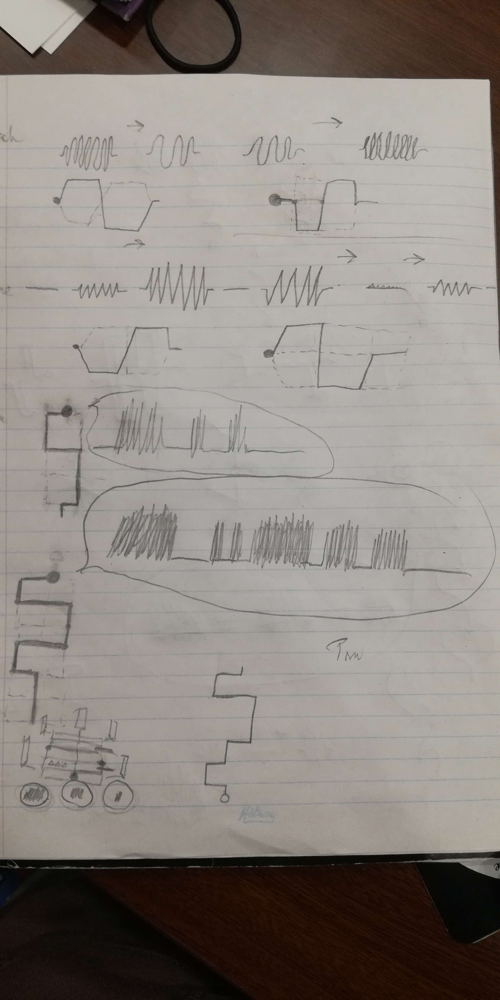
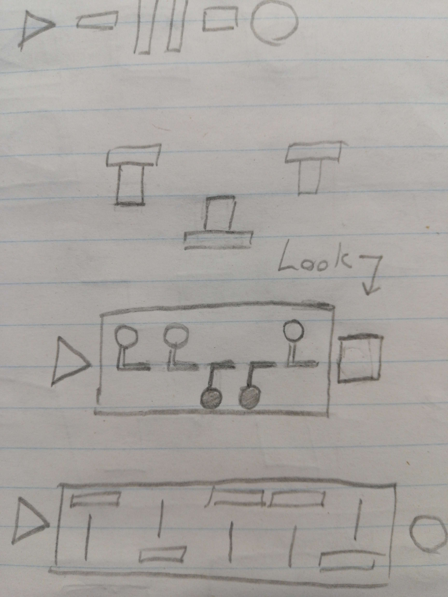

For a long time, I've thought of a music and sound-based puzzle game inspired by the ephiphany-based progression of The Witness.

I was always mildly disappointed by where The Witness' audio puzzles stopped short of achieving something more complex, and frustrated that the bar to entry was still too high for most players to properly appreciate.

Anyways, I wanted an audio puzzle game that would still be playable without the sound on. However, I still wanted this game to rewards players for listening closely, to them gain an appreciation for sound and its many properties.

For example, "pitch" is a concept most people understand by demonstration. Even someone who is not hearing can feel the difference between the low-frequency shockwave of an explosion, compared to the tiny vibration of their phone. But to have people convey what pitch means, in a more objective sense, is the hard part.

Anyway, if you're interested in hearing more rambling from me, here's a 5 minute video I recorded right when I was in the thick of it:

<iframe width="553" height="315" src="https://www.youtube.com/embed/wWKtKtn_mWU" title="my audio jungle puzzle prompt" frameborder="0" allow="accelerometer; autoplay; clipboard-write; encrypted-media; gyroscope; picture-in-picture; web-share" allowfullscreen></iframe>

So anyway, next day. I'm still interested in this idea, but I need to figure out which input method to use for my puzzles.

Most of this came out of iterating on "the line" from The Witness. A shape you draw on a grid, with intersections determining where the line can go next. You also can't loop over your own line.

But I wasn't happy with just stealing the line. I wasn't going to use all affordances of the line to my advantage. I couldn't see how covering intersections, defining regions, and navigating mazes would benefit the audio-focused gameplay. I'd just be making the sequel to a game that already did nearly everything it set out to do, with my own twist on it. Maybe that's what people want, but I feel like there's a simpler way to do it with fewer elements. (Plus, I don't want to be accused of being a blowhard.)

But while I’m in this derivative mindset, I spent some time drawing up how you could show the audio information visually as if it <em>were</em> The Witness. I thought about how you could make interesting Witness lines based on the main idea.

Original sketches I did in my “night of passion” are as follows:

This one shows changes in timbre, pitch, volume, and even rhythm. Each example shows the corresponding answer in a high-low distinction. Except for rhythm, which is traversed in a sequence of 3-way inputs to determine note length.

This one shows more in regards to timbre, and a graph to input them using a distinct visual indicator of timbre change over time. A bit complex, but it made me happy to assign unique line shapes to different audio properties like this.

This last one is a bit too complicated to explain in this one post, I'll come back to these ideas in a dedicated post since I'm really happy with the shapes I ended up drawing.

Anyways. Anothre day follows. I like the idea of the lines, but they're not unique enough to stand out. I swear there's a simpler way to do this. Especially on say, a smartphone.

So, if I’m not doing lines from The Witness...what am I doing for this puzzle game?

I’ve decided I’m gonna have multiple input methods, all revolving around the mouse or touchscreen.

My most common input is going to be a binary switch, kind of like Taiji. Only I want to emphase “on” vs “off” and have a stronger distinction to associate “up” with “on”.

More like inputting a code in an adventure game, the idea is to give the player a line of switches. The number of switches correspond to the unique elements in the sound clip. From left to right, the switches represent the time of different changes in the sound.

For each category of puzzle (say, pitch-based puzzles) player has to figure out which of the elements belongs “up” and which belongs “down”. Higher pitches go up, lower pitches go down.

Here's some sketches of what I was coming up with at the time for UI:

I am also considering adding an input method for 3-way distinction, which will be necessary for later pitch puzzles. I’m still trying to figure out what I want here.

I could change the on/off switches to vertical radio buttons to select high/med/low pitch. That’s probably the best answer even if I don’t like it. It feels less accessible to input a range in a slider than it does just pressing a button. I want to avoid the spaceship sliders in Myst where accuracy was really difficult to achieve. But hopefully, 3 inputs instead of like 40 will solve itself there.

It was at this point I started showing these drawings around a few puzzle game communities. Namely The Witness, Lingo, and Taiji. And I caught the attention of UX designer Juchu.

Now I’ve invited Juchu who is a UX designer onto the team. My hope is to slowly expand the team to take on the larger workload I’ve set out for myself.

Though I’m still considering pivoting the game away from pure puzzles and moving toward an adevnture game style. Something more art focused than raw rules. I think that would help broaden the appeal while playing to my own strengths of making story-based games.

---

And then, I spent about a week just making puzzles, playtesting the idea with my family, and meeting with Juchu.

As of writing I have 13 puzzles down, and many more to go.

Here’s some thoughts on accessibility with the current set of pitch puzzles, and trying to find recognizable bird sounds for those puzzles:

The hardest part is that the first few puzzles are pitch puzzles, and I want to use bird sounds to keep a cute real-world analog to the puzzles.

I’m trying to use xeno canto’s massive (and mostly permissive) database to find appropriate bird sounds for each puzzle. It’s not easy to find the pattern that I want that will convey the right idea. I can see why the witness’ puzzle complexity drops off after a certain point. Songs like the Loon’s are like lightning in a bottle for pitch recognition, there’s not many others that are quickly recognizable as birds that people would’ve heard before.

When it comes to The Witness, I still laugh from reading some people’s help queries on the Loon puzzle, or watching playthroughs on Youtube, saying it’s a “wolf sound” and the panel’s trying to teach you to listen to sounds that aren’t birds. It’s fair enough, just funny.

Cuckoo is easy to break down. Chickadee similarly. But more complex patterns become harder to translate without really slowing it down, or asking that players have decent rhythmic perception. It’s really hard to find birds that will chirp slowly at a pace that human language processing is good at anticipating.

Worse still, Juchu has pointed out how shrill and sometimes painful a birdcall can be to hear, especially coming from a cheap speaker. A bird is trying to communicate with other birds, we humans need them to slow it down and pitch it donw to make sense for our kind of communication speed. And if you slow down a bird call, well, it's no longer the same bird call anymore.

I’m considering adding some audio accessibility toggles like removing the reverb, allowing the sounds to be played back slowly, and showing a truly-accurate histogram of the sound for precise analysis. It’s never my intent for these tools to be necessary to be solve the puzzles, but I know that it will be appreciated by those who struggle to hear those sounds. I know that from one of my playtests, a player had trouble hearing how to interpret a certain sound but still didn’t use the oscilloscope for information at all.

Considering how I want to implement rhythm or “counting”. I think counting a fast rhythm is kind of lame and inaccessible. Good for musicians I suppose. I just can’t find a way to encode “number of beeps” as player input without just having a keypad. I want something more game-y and less school-y, but maybe that’s the best I’ve got for now. The sound that made me think of this is [here on xeno canto.](https://xeno-canto.org/719869)

I’m porting over a private discord channel of notes to myself into this devlog system, I’m much happier keeping this thing public and available as just HTML that anyone can read. Hopefully I can get into some more technical implementations, but I’ll try to wait until my systems are less copy-paste and better suited for the amount of puzzles I’m looking to do. Until next time!

<!-- %enddocs -->
